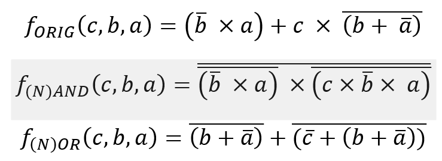
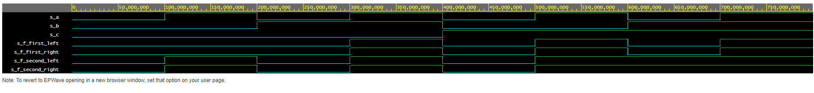

# CV 1

### De Morganuv zákon

1. Logické funkce :

   

2. VHDL kód
```vhdl
architecture dataflow of gates is
begin
    f_orig_o <= (not(b_i) and a_i) or (c_i and not(b_i or not(a_i)));
    f_nand_o <= not(not(not(b_i) and a_i) and not(c_i and not(b_i) and a_i));
    f_nor_o  <= not(b_i or not(a_i)) or not(not(c_i) or (b_i or not(a_i)));
end architecture dataflow;
```

3. Tabulka výstupních hodnot

   | **c** | **b** |**a** | **f_ORIG** | **f_(N)AND** | **f_(N)OR** |
   | :-: | :-: | :-: | :-: | :-: | :-: |
   | 0 | 0 | 0 | 0 | 0 | 0 |
   | 0 | 0 | 1 | 1 | 1 | 1 |
   | 0 | 1 | 0 | 0 | 0 | 0 |
   | 0 | 1 | 1 | 0 | 0 | 0 |
   | 1 | 0 | 0 | 0 | 0 | 0 |
   | 1 | 0 | 1 | 1 | 1 | 1 |
   | 1 | 1 | 0 | 0 | 0 | 0 |
   | 1 | 1 | 1 | 0 | 0 | 0 |

### Distributivní zákony

1. Signály 

   

```vhdl
architecture dataflow of gates is
begin
    f_first_left <= (a_i and b_i) or (a_i and c_i);   -- first distribution law left side
    f_first_right <= a_i and (b_i or c_i); 	      -- first distribution law right side
    f_second_left  <= (a_i or b_i) and (a_i or c_i);  -- second distribution law left side
    f_second_right  <= a_i or (b_i and c_i);  	      -- second distribution law right side
end architecture dataflow;
```

2. EDA:

   [https://www.edaplayground.com/x/5L92]https://www.edaplayground.com/x/5L92)
